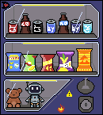
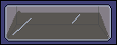
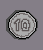

<div align="center">


### Vending Machine — Autômato Finito com Saída

<p>
Uma máquina de vendas que aceita moedas de 5, 10 e 25 centavos
e entrega um produto por 30 centavos.
</p>

</div>

---

<p align="center">

<a href="https://vending-machine-sooty.vercel.app/">
  
</a>

<a href="https://jopako.github.io/Vending-Machine/">
  
</a>

</p>

---

## Sobre o projeto

**Vending Machine** é uma simulação web de uma máquina de vendas
modelada utilizando um **Autômato Finito com Saída**.

A máquina aceita moedas de:

- **5 centavos**
- **10 centavos**
- **25 centavos**

O produto possui valor fixo de **30 centavos**.

O sistema acompanha o saldo acumulado por meio dos estados do
autômato e, quando o valor inserido atinge ou ultrapassa 30 centavos,
a máquina libera o produto e calcula o troco.

O projeto foi desenvolvido como parte da disciplina de
**Teoria da Computação**, buscando transformar o modelo formal de um
autômato em uma aplicação web interativa e visual.

---

# Interfaces

## Introdução


## Vending Machine


---

## Como funciona

A máquina utiliza estados que representam o valor acumulado:

```text
q0   → 0 centavos
q5   → 5 centavos
q10  → 10 centavos
q15  → 15 centavos
q20  → 20 centavos
q25  → 25 centavos
```

---

# Tecnologias utilizadas

## Frontend

<div align="center">

[](https://skillicons.dev)

</div>

- **React** — construção da interface e componentes
- **TypeScript** — tipagem e implementação da lógica
- **Vite** — ambiente de desenvolvimento e build
- **CSS** — estilização, layout e responsividade

---

## Modelagem do Autômato

<div align="center">


</div>

- **JFLAP** — criação, visualização e testes do autômato
- **Máquina de Mealy** — modelo utilizado para representar as transições e saídas
- **Autômato Finito com Saída** — modelagem formal da máquina de vendas
---
# Sprites

<div align="center">

Todas as sprites utilizadas no projeto foram criadas por mim utilizando o **Aseprite**.

</div>

As **sprites** são imagens utilizadas para representar visualmente os
elementos do projeto. Neste caso, elas foram utilizadas para compor a
interface da máquina de vendas, representar as moedas e criar o personagem
presente na tela inicial.

## O Velho

O personagem presente na tela inicial foi criado para representar o dono da
máquina de vendas e introduzir o jogador à aplicação.

<div align="center">  </div>

## Máquina de vendas

A sprite principal representa a parte frontal da máquina de vendas.

<div align="center">



</div>

## Saída do produto

Essa sprite representa o compartimento onde o produto é entregue ao jogador.

<div align="center">



</div>

## Moedas

As moedas aceitas pela máquina também foram criadas individualmente como
sprites.

<div align="center">





</div>

As três sprites representam as entradas aceitas pelo autômato:

```text
5¢  → moeda de 5 centavos
10¢ → moeda de 10 centavos
25¢ → moeda de 25 centavos
```
---

<div align="center">

By: João Paulo Kowalski

</div>
